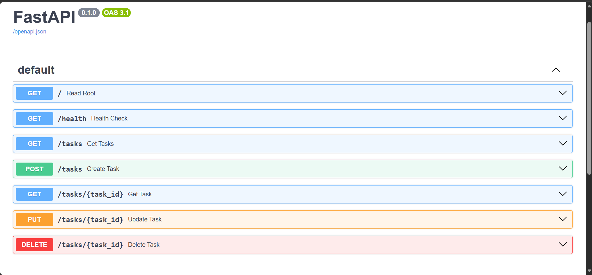

# Task API - CRUD API

A simple REST API for managing a to-do list with full CRUD operations (Create, Read, Update, Delete). Built with Python FastAPI.

## Features

- Create, read, update, and delete tasks
- In-memory data storage (data resets on server restart)
- Input validation
- Proper HTTP status codes
- Interactive Swagger UI documentation at `/docs`

## Installation & Running

### Prerequisites
- Python 3.10 or higher

### Install dependencies
```bash
pip install fastapi uvicorn
```

### Run the server
```bash
python -m uvicorn main:app --reload
```

The server will start on `http://localhost:8000`

## API Endpoints

| Method | Endpoint | Description | Status Codes |
|--------|----------|-------------|--------------|
| GET | `/` | API information | 200 |
| GET | `/health` | Health check | 200 |
| GET | `/tasks` | List all tasks | 200 |
| GET | `/tasks/{id}` | Get a single task by ID | 200, 404 |
| POST | `/tasks` | Create a new task | 201, 400 |
| PUT | `/tasks/{id}` | Update a task | 200, 400, 404 |
| DELETE | `/tasks/{id}` | Delete a task | 204, 404 |

## Example curl Output

### Create a task
```bash
curl -i -X POST http://localhost:8000/tasks -H "Content-Type: application/json" -d '{"title":"Buy milk"}'
```

Response:
```
HTTP/1.1 201 Created
content-type: application/json
content-length: 38

{"id":4,"title":"Buy milk","done":false}
```

### Get all tasks
```bash
curl -i http://localhost:8000/tasks
```

Response:
```
HTTP/1.1 200 OK
content-type: application/json
content-length: 145

[{"id":1,"title":"Learn FastAPI","done":false},{"id":2,"title":"Build CRUD API","done":true},{"id":3,"title":"Write README","done":false},{"id":4,"title":"Buy milk","done":false}]
```

### Get single task
```bash
curl -i http://localhost:8000/tasks/1
```

Response:
```
HTTP/1.1 200 OK
content-type: application/json
content-length: 40

{"id":1,"title":"Learn FastAPI","done":false}
```

### Update a task
```bash
curl -i -X PUT http://localhost:8000/tasks/1 -H "Content-Type: application/json" -d '{"done":true}'
```

Response:
```
HTTP/1.1 200 OK
content-type: application/json
content-length: 41

{"id":1,"title":"Learn FastAPI","done":true}
```

### Delete a task
```bash
curl -i -X DELETE http://localhost:8000/tasks/1
```

Response:
```
HTTP/1.1 204 No Content
```

### Error handling (404)
```bash
curl -i http://localhost:8000/tasks/99
```

Response:
```
HTTP/1.1 404 Not Found
content-type: application/json
content-length: 29

{"detail":"Task 99 not found"}
```

### Error handling (400)
```bash
curl -i -X POST http://localhost:8000/tasks -H "Content-Type: application/json" -d '{}'
```

Response:
```
HTTP/1.1 400 Bad Request
content-type: application/json
content-length: 32

{"detail":"Title is required"}
```

## Swagger UI

Interactive API documentation is available at `http://localhost:8000/docs`



## Data Persistence

**Important:** This API uses in-memory storage. All data is lost when the server restarts. This is intentional for this assignment - a real application would use a database for persistence.

## Git Commits

This project was built in stages, with one commit per stage:
- Week 2: Stage 0: hello server
- Week 2: Stage 1: root and health endpoints
- Week 2: Stage 2: read endpoints with 404
- Week 2: Stage 3: create with validation
- Week 2: Stage 4: full CRUD
- Week 2: Stage 5: Swagger UI
- Week 2: Stage 6: publish and docs
